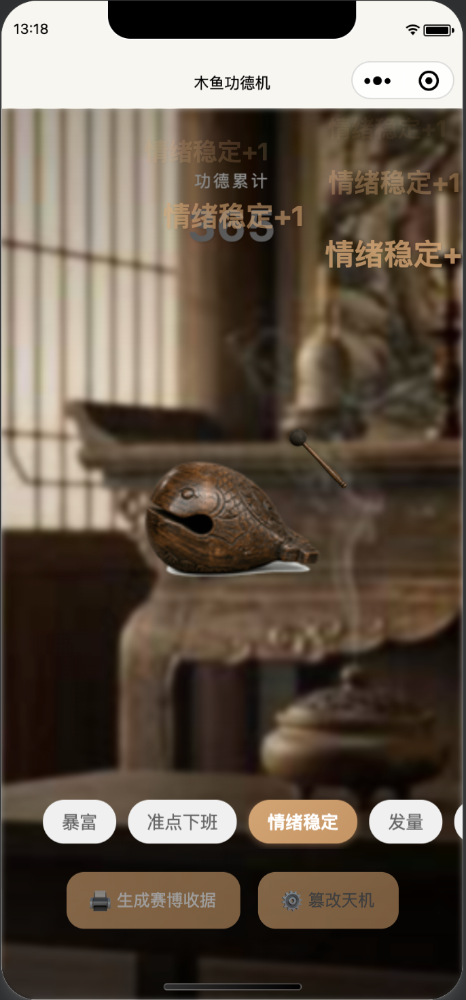
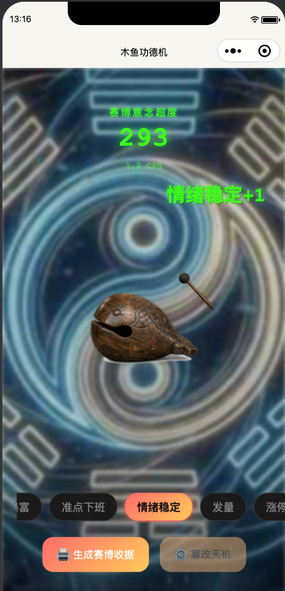
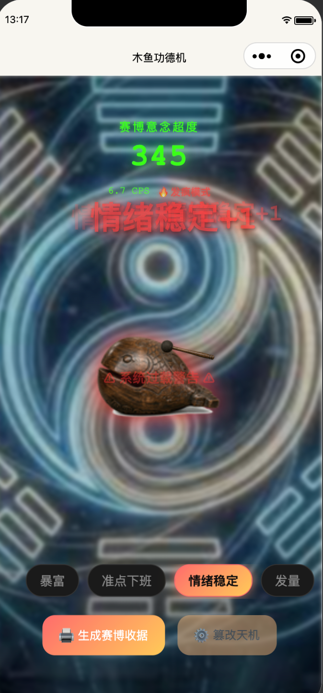
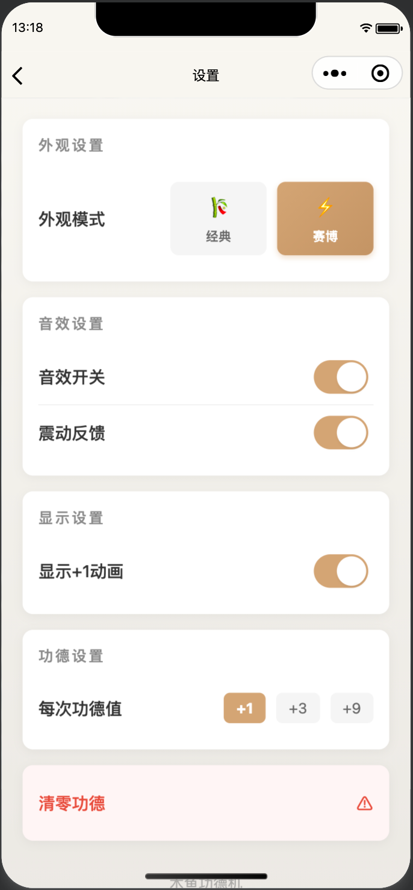

# 🐟 赛博功德机

### 唯物主义祈福工具

[English](README_EN.md) | 中文

---

<p align="center">
  
  
</p>

---

## 🎮 核心玩法

点击木鱼 = 敲击 + 功德累积

### 双模式体验

| 经典模式 | 赛博模式 |
|:--------:|:--------:|
| 禅意木鱼 | 霓虹功德 |
| 静谧氛围 | 科幻过载 |
| 传统美学 | 赛博朋克 |

### 特色功能

- ⚡ **CPS 实时监测** - 每秒点击数追踪
- 🔥 **过载模式** - CPS > 5 触发"发疯模式"
- 🎯 **九大心愿** - 暴富、准点下班、情绪稳定、发量、涨停、颜值、脱单、上岸、好梦
- 📤 **分享收据** - 生成复古热敏小票风格的分享图

---

## 📸 预览

### 经典模式
<p align="center">
  
</p>

### 赛博模式
<p align="center">
  
  
</p>

### 配置页面
<p align="center">
  
</p>

---

## 🛠️ 技术栈

- **框架**: 微信小程序
- **语言**: WXML + WXSS + JavaScript
- **特色**: Canvas 2D 动态分享图生成

---

## 🚀 使用说明

### 开发

```bash
# 克隆项目
git clone https://github.com/cstdr/mini-wooden-fish.git

# 使用微信开发者工具打开项目
# 导入项目目录即可
```

### 分享图生成逻辑

每次分享会随机生成一张复古热敏小票风格的图片，包含：
- 当前功德数
- 选中的心愿关键词
- 随机"发疯文学"文案
- 歪斜的红色"查收成功"印章

---

## 📄 License

[MIT License](LICENSE)

---

<p align="center">
  <sub>敲木鱼，积功德，治精神</sub>
</p>
